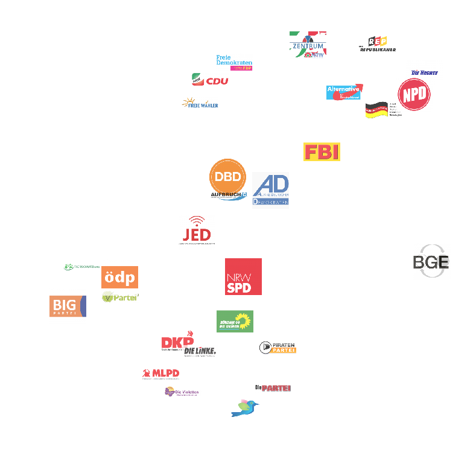

Wahl-O-Mat Visualization with t-SNE
===================================

This project uses the parties' answers to the 2017 NRW wahl-o-mat questions to
place them in a high-dimensional space and then creates a 2D-visualization with
t-SNE that shows which parties are aligned or hold contrary views, respectively.

Data Acquisition
----------------

wahl-o-mat_ offers a PDF_ that lists all parties' anwers in table
form. Unfortunately, the answers are embedded in image form which makes it
impossible to scrape them automatically from the document. I still put the PDF
into `/data` for reference purposes. Instead, I have downloaded the final HTML
page where you can compare your opinion with up to 8 parties and extracted the
parties' answers from those documents. The HTML sources are stored in `/data`,
the extraction script is `data_from_html.py` and the data is in
`/data/data.csv`.

.. _PDF: https://www.wahl-o-mat.de/nrw2017/PositionsvergleichNordrheinWestfalen2017.pdf
.. _wahl-o-mat: https://www.wahl-o-mat.de/

Visualization
-------------

The visualization is implemented in the jupyter notebook `visualize.ipynb`. The
methodology is nicely illustrated in the `article on t-SNE`__ in the distill
online journal. After some experimentation, I was able to produce the following
plot.

.. __: http://distill.pub/2016/misread-tsne/

   The ideological similarities between parties could be recovered from just 38
   yes/no/neutral questions. There is a nazi cluster in the top-right, a
   communist cluster at the bottom and the environmentalists are grouped in
   bottom-left.

   Please note, that there is no meaning to the plot axis. All the information
   is in the distance between parties.
